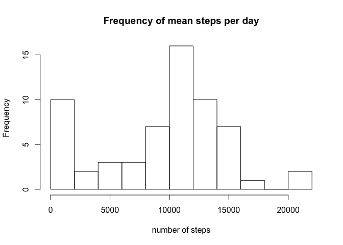
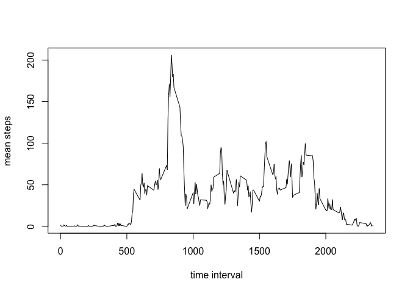
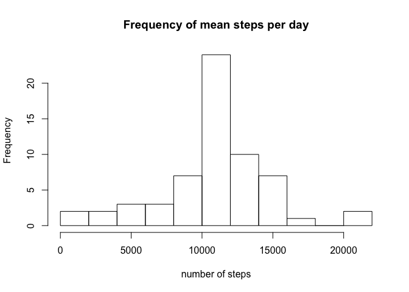
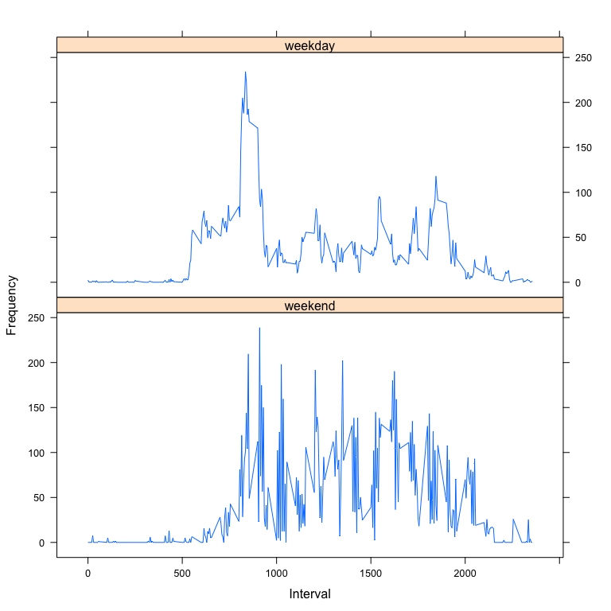

# Reproducible Research: Peer Assessment 1


## Loading and preprocessing the data


## R Markdown

```r
library(plyr)
```

Read file

```r
temp <- tempfile()
download.file("https://d396qusza40orc.cloudfront.net/repdata%2Fdata%2Factivity.zip",temp)
temp2.csv <- unzip(temp)
activity <- read.csv(temp2.csv, header=TRUE)
```

## What is mean total number of steps taken per day?
Plot histogram of mean steps taken per day

```r
hist(tapply(activity$steps, activity$date, sum, na.rm=TRUE), breaks = 10, xlab="number of steps", main = "Frequency of mean steps per day")
```

<!-- -->

Mean steps taken per day

```r
mean(tapply(activity$steps, activity$date, sum, na.rm=TRUE))
```

```
## [1] 9354.23
```

Median steps taken per day

```r
median(tapply(activity$steps, activity$date, sum, na.rm=TRUE))
```

```
## [1] 10395
```


## What is the average daily activity pattern?

Line plot of mean steps per time interval

```r
intervalmean <- aggregate(activity$steps, list(activity$interval), mean, na.rm=TRUE)
plot(intervalmean[,1], intervalmean[,2], type = "l", xlab = "time interval", ylab = "mean steps")
```

<!-- -->

Find interval with most steps

```r
findtop <- with(intervalmean, order(-x))
top <- findtop[1]
intervalmean[top,1]
```

```
## [1] 835
```


## Imputing missing values
How many rows when NAs removed?

```r
length1 <- length(activity$steps)
activity_nona <- na.omit(activity)
length2 <- length(activity_nona$steps)
length1-length2
```

```
## [1] 2304
```

Create a new dataset with NAs replaced by interval means and make a histogram of total steps taken each day

```r
activity2 <- activity
for(i in 1:length(activity2$steps)){
      if(is.na(activity2[i,1])){
            interval <- activity2[i,3]
            activity2[i,1] <- intervalmean[intervalmean[,1] %in% interval, 2]
      } 
}
hist(tapply(activity2$steps, activity2$date, sum), breaks = 10, xlab="number of steps", main = "Frequency of mean steps per day")
```

<!-- -->

Mean steps taken per day

```r
mean(tapply(activity2$steps, activity2$date, sum, na.rm=TRUE))
```

```
## [1] 10766.19
```

Median steps taken per day

```r
median(tapply(activity2$steps, activity2$date, sum, na.rm=TRUE))
```

```
## [1] 10766.19
```


## Are there differences in activity patterns between weekdays and weekends?
Plot weekend and weekday steps

```r
weekend <- c("Saturday", "Sunday")
weekday <- c("Monday", "Tuesday", "Wednesday","Thursday", "Friday")
activity$days <- weekdays(as.Date(activity$date))
weekenddata <- activity[activity$days==weekend,]
weekdaydata <- activity[activity$days %in% weekday,]
library(lattice)
wkendmean <- aggregate(weekenddata$steps, list(weekenddata$interval), mean, na.rm=TRUE)
wkdaymean <- aggregate(weekdaydata$steps, list(weekdaydata$interval), mean, na.rm=TRUE)
xyplot(x~Group.1|which, make.groups(weekend=wkendmean, weekday=wkdaymean), layout=c(1,2), type="l", xlab="Interval", ylab="Frequency")
```

<!-- -->
